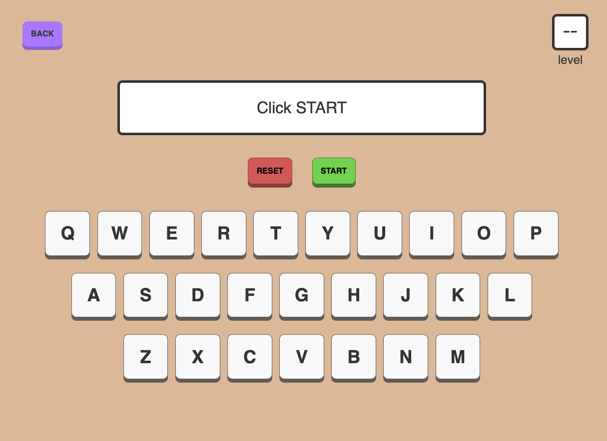
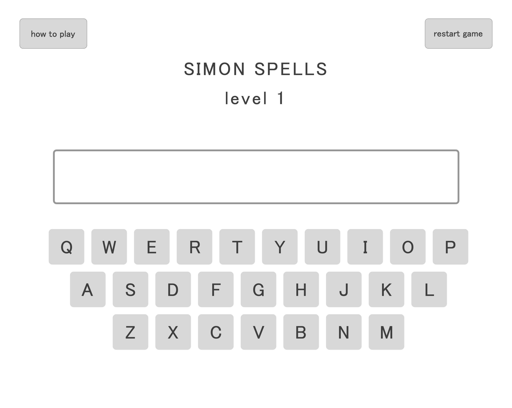
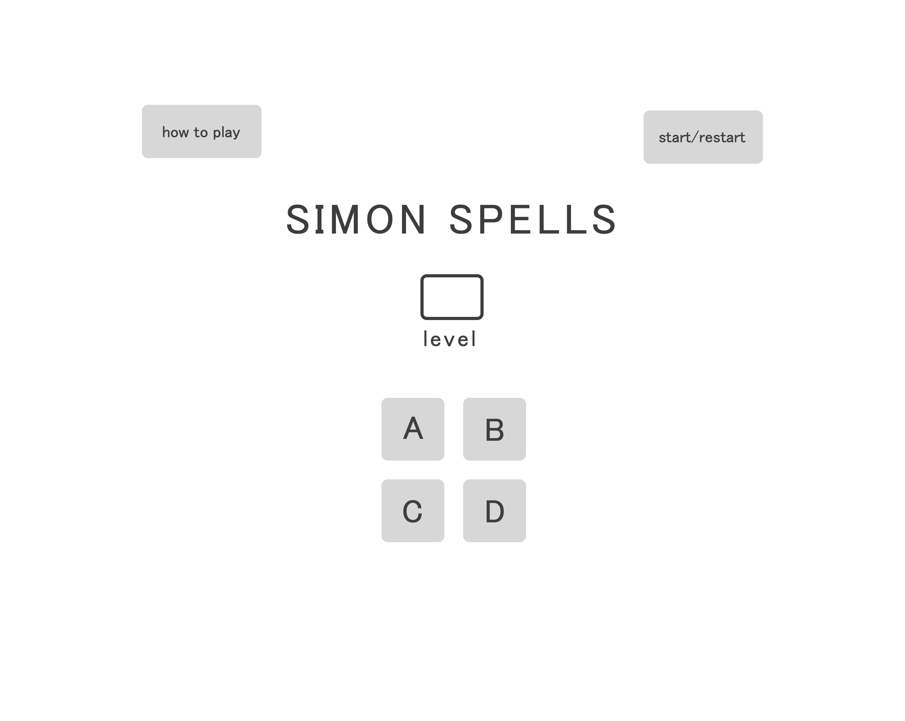
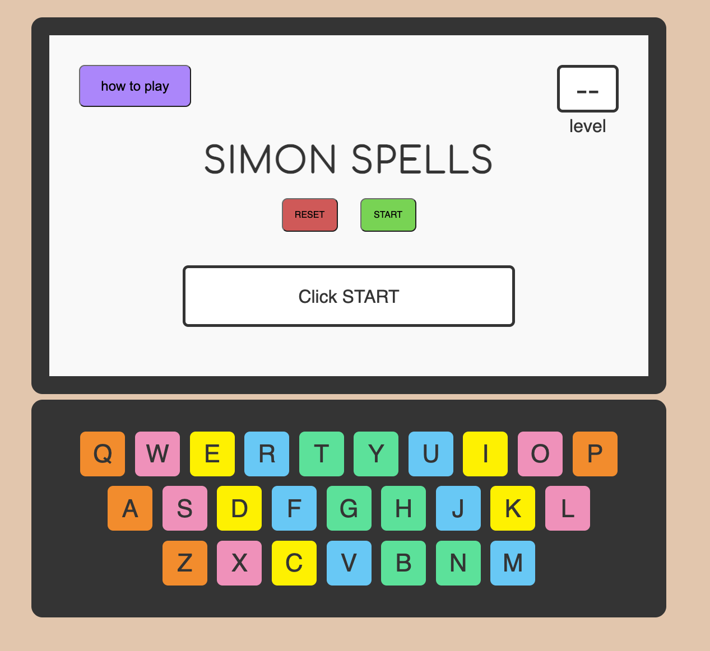
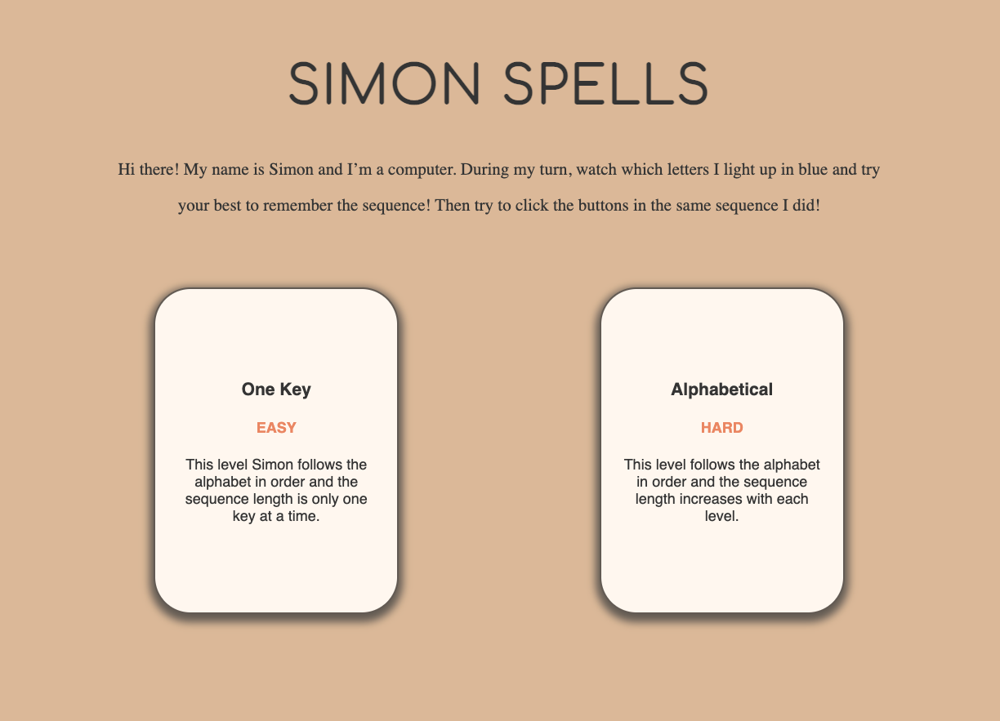

# Simon Spells



## About The Game
Simon Spells puts a virtual, early-education twist on the game, Simon Says. During Simon's turn, a player must watch and try to memorize a sequence of keys played by Simon, or in this case, the computer. Then during their turn, they must click the keys in the same order as Simon did. In this version, Simon's growing sequence follows the same sequence as the alphabet and the level number correlates to the amount of letters in the sequence. For example, in level 3, Simon will play keys, A, B, then C. 

### Languages Used
- HTML
- JavaScript
- CSS

### Play: [SIMON SPELLS Version 2.0](https://kaciekomoto.github.io/Simon-Spells/)

## Idea Inspiration
The inspiration for this game was my 3-year-old niece, who likes to sit next to me as I work and imitate a taping-typing motion on the table. Thus, my goal was to create a simple and fun game to help early education learners learn their ABCs while familiarizing them with a computer keyboard layout.


## The First Wireframe


## User Walkthrough
- Player may click on the button "how to play" to access a modal explaining the game instructions
- Player clicks the START button and the game begins with Simon playing the first sequence
- Player imitates Simon's sequence to the best of their memory
- If player enters correct sequence, they advance to the next level
- If player enters incorrect sequence, they're informed on the screen to hit the RESET button
- Once all levels are completed, player is congratulated and the game is reset
- Player at any time can click the RESET button to clear all inputs

## Version 1.0
### Getting the Core Game Logic
In order to focus on the getting the core game logic to work, I simplified my original idea to get the first 4 keys (A, B, C, and D) to work before implementing the entire keyboard. 


### Project Presentations
The picture below is what I presented to my instructors and classmates after our 2-week project sprint.


### Major Hurdles & Bugs
Major Hurdles
1. Timing the ```setTimeout()```
2. Creating responsive design for mobile devices


## Version 2.0
Post-presentations, I also showed my project to other Software Engineers and made iterations based on the feedback collected. 




### Version 2.0 Iterations
1. Improved UX/UI elements
    - Keyboard design and how the keys light up
    - Create an easier version that only lights up one-key at a time 
        - After having my niece try it out, I quickly realized that the original version was too difficult for her. Thus, I want to create versions with varying difficulties and make it more accessible to those of different ages and learning levels.
2. Improved Media Responsiveness


## Ideas for Future Modifications
1. Fix Programming Bugs
    - When RESET is clicked it doesn't immediately stop Simon's Sequence
    - Player is only informed when it's Simon's turn and not their turn
    - Player can click keys during Simon's turn
2. Continue improving UX/UI elements and Usability Testing
3. Implement Audio of the ABC song
4. Creat a version where Simon selects keys at random
5. A feature that allows the user to click the physical keyboard in addition to the virtual keyboard
6. Hints if the user gets stuck
